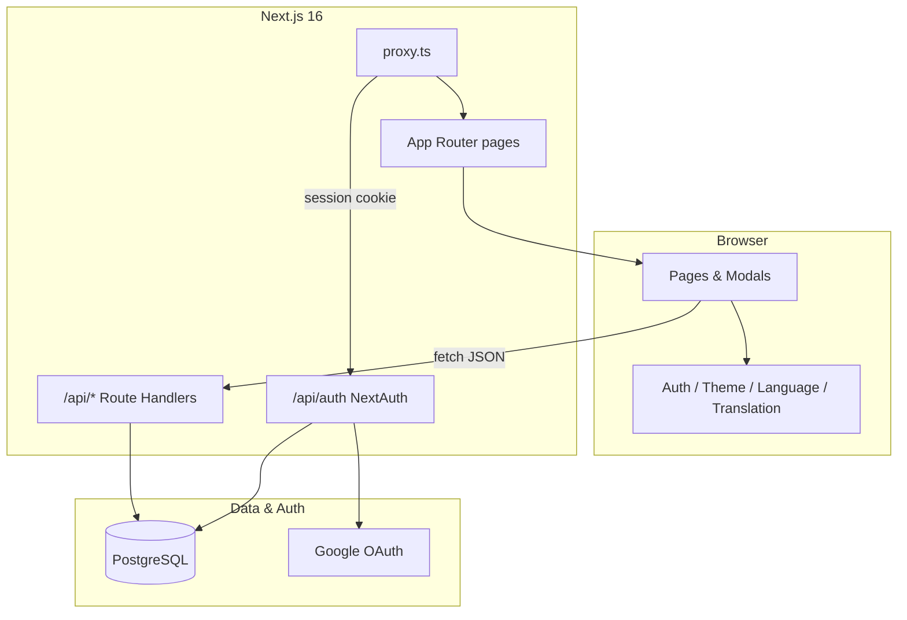
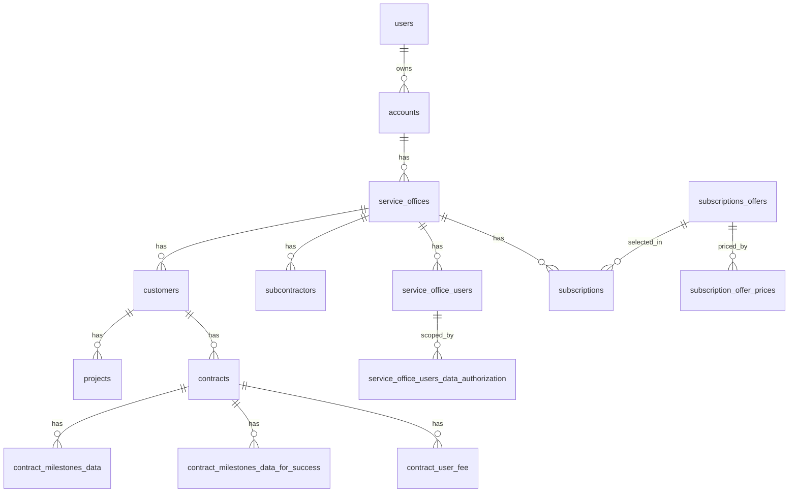

# BaaS (Timese) – Application Architecture

> **Purpose:** Single source of truth for architecture, tech stack, data model, API, components, and flows.  
> **Audience:** New team members and contributors.  
> **Interactive view:** Open [`architecture.html`](./architecture.html) in a browser for diagrams and a visual overview.  
> **Maintenance:** Update this document at the end of every significant change (see [§11 Cursor rule](#11-cursor-rule-updating-this-document)).

---

## Table of contents

1. [Application overview](#1-application-overview)  
2. [Technologies used](#2-technologies-used)  
3. [High-level architecture](#3-high-level-architecture)  
4. [System flows](#4-system-flows)  
5. [Frontend](#5-frontend)  
6. [Backend (API)](#6-backend-api)  
7. [Database](#7-database)  
8. [Security](#8-security)  
9. [Components catalog](#9-components-catalog)  
10. [Repository layout](#10-repository-layout)  
11. [Cursor rule (updating this document)](#11-cursor-rule-updating-this-document)

---

## 1. Application overview

| Item | Detail |
|------|--------|
| **Product name** | BaaS / **Timese** – Bill Management for SMBs |
| **Type** | Full-stack multi-tenant web application |
| **Primary users** | Account owners (Google sign-in) who manage service offices and business data |
| **Secondary actors** | Service office users (employees/subcontractors) with scoped data access |

**Business domain:** Service offices operate under **accounts**. Each service office has **customers**, **projects**, **contracts**, **subcontractors**, **subscription plans**, and **service office users**. Contracts support multiple billing models (milestones, hourly fees, success milestones). The app also provides **i18n** (languages, screen labels, auto-translate) and **admin** screens (system lookups, UI screens, API keys, playground).

**Tenancy model:** Multi-tenant at the **account** level. The logged-in app user (`users`) owns one or more `accounts`. All operational data hangs off `service_offices` → `account_id` → `accounts.user_id`. API routes enforce access by joining through `accounts` so users never see another tenant’s rows.

---

## 2. Technologies used

Technologies are grouped by layer. Versions reflect `package.json` unless noted.

### 2.1 Frontend

| Technology | Version / role |
|------------|----------------|
| **React** | 19.2.3 – UI library; client components for interactive pages and modals |
| **Next.js App Router** | 16.1.1 – Routing, RSC root layout, API co-location under `app/api/` |
| **TypeScript** | 5.9.x – Typing across app, API, and `database/*` feature modules |
| **Tailwind CSS** | 4.x (`@tailwindcss/postcss`) – Utility-first styling |
| **next/font** | Geist Sans & Geist Mono – Optimized web fonts |
| **next-themes** | 0.4.6 – Theme persistence (used with custom `ThemeProvider`) |
| **Radix UI** | `@radix-ui/react-slot` – Primitive for composable UI |
| **class-variance-authority** | 0.7.x – Variant styling for Shadcn-style `components/ui/*` |
| **tailwind-merge** | 3.4.x – Class name merging in UI helpers |
| **lucide-react** | 0.562.x – Icons (where used) |
| **next-auth/react** | Session on client (`useSession`, `signOut`) |

**Frontend patterns:**

- **Server Components:** Root `app/layout.tsx` prefetches NextAuth session server-side.
- **Client Components:** Data grids, modals, sidebar, and contexts use `"use client"`.
- **No separate SPA:** Pages fetch REST JSON from `/api/*` and render in place.
- **i18n:** `LanguageProvider` + `TranslationProvider` + `AutoTranslate` + `languages_screens_translations` dictionary.

### 2.2 Backend

| Technology | Version / role |
|------------|----------------|
| **Node.js** | Runtime (via Next.js) |
| **Next.js Route Handlers** | `app/api/**/route.ts` – REST endpoints |
| **NextAuth.js** | 4.24.x – Google OAuth, JWT session, `/api/auth/[...nextauth]` |
| **pg (node-postgres)** | 8.18.x – PostgreSQL client (`getDbClient()`) |
| **Nodemailer** | 7.x – SMTP for account email verification (optional) |
| **Resend** | 6.x – Alternative email delivery |
| **LangChain** | `@langchain/*`, `langchain` – GitHub summarizer playground (optional OpenAI) |

**Backend patterns:**

- Each API route calls `getAuthenticatedUser()` from `app/lib/auth.ts` when auth is required.
- Authorization: SQL joins through `accounts` with `user_id = $authenticatedUserId`.
- DB access: `getDbClient()` → `connect()` → parameterized queries → `end()` in `try/finally`.
- Shared logic in `app/lib/*` (milestone validation, subscription price history, feature flags).
- **Request boundary:** `proxy.ts` (Next.js 16) guards **page** routes; API routes enforce auth themselves.

**Configuration (not committed):**

- `.env.local` – `NEXTAUTH_SECRET`, `GOOGLE_CLIENT_ID`, `GOOGLE_CLIENT_SECRET`, optional `PG*` env vars.
- `database/db-config.json` – PostgreSQL connection fallback when env vars are absent.

**Committed config:**

- `config/app-feature-settings.json` – e.g. `EnableEmailVerification` (see `app/lib/app-feature-settings.ts`).

### 2.3 Database

| Technology | Role |
|------------|------|
| **PostgreSQL** | Primary data store |
| **SQL scripts** | `database/<entity>/create-*.sql`, `alter-*.sql`, `migrate-*.sql` |
| **Runners** | `database/run-sql.mjs`, `database/verify-table.mjs` |

**Connection resolution** (`database/accounts/db-client.ts`):

1. Prefer env: `PGHOST`, `PGPORT`, `PGDATABASE`, `PGUSER`, `PGPASSWORD`, optional `PGSSL`.
2. Else read `database/db-config.json` → `postgresql` object.

**Note:** The app uses a new `pg.Client` per request path (no pool in `db-client.ts`).

---

## 3. High-level architecture

### 3.1 Layer diagram (ASCII)

```
┌──────────────────────────────────────────────────────────────────────────┐
│                         Browser (Client)                                  │
│   React 19 · Tailwind 4 · Contexts (Auth, Theme, Language, Translation) │
│   Client pages + modals under database/ · Landing components/             │
└──────────────────────────────────────────────────────────────────────────┘
                                      │
                                      ▼
┌──────────────────────────────────────────────────────────────────────────┐
│                    Next.js 16 (single deployable unit)                    │
│  ┌─────────────┐   ┌──────────────────┐   ┌────────────────────────────┐ │
│  │ proxy.ts    │   │ App Router       │   │ API Route Handlers         │ │
│  │ (page auth  │──▶│ layout, pages,   │──▶│ /api/* REST + NextAuth     │ │
│  │  gate)      │   │ RSC + client)    │   │ getAuthenticatedUser()     │ │
│  └─────────────┘   └──────────────────┘   └────────────────────────────┘ │
└──────────────────────────────────────────────────────────────────────────┘
                    │                              │
                    ▼                              ▼
         ┌──────────────────┐          ┌─────────────────────┐
         │ NextAuth (Google) │          │ PostgreSQL (pg)      │
         │ JWT session       │          │ Tenant-scoped tables │
         └──────────────────┘          └─────────────────────┘
```

### 3.2 Mermaid – request path



### 3.3 Mermaid – tenant data hierarchy



---

## 4. System flows

### 4.1 Authentication

1. User opens a **protected page** → `proxy.ts` runs (matcher excludes `/api`, static assets).
2. If no `next-auth.session-token` (or secure variant) and no valid JWT → redirect to `/` with `?message=Please sign in...`.
3. Landing `/` offers Google sign-in via NextAuth.
4. `signIn` callback upserts row in `users` (email, name, image, provider).
5. Session is **JWT-based**; server APIs resolve the DB user by email via `getAuthenticatedUser()`.

### 4.2 Typical CRUD API call

1. Client modal or page `fetch("/api/customers?service_office_id=5")`.
2. Route: `getAuthenticatedUser()` → 401 if missing.
3. SQL joins `customers` → `service_offices` → `accounts` WHERE `accounts.user_id = $1`.
4. JSON response; UI updates grid or closes modal.

### 4.3 Service office user data authorization

- **Service office users** are not app login users; they belong to a service office.
- Table `service_office_users_data_authorization` grants access to customers, projects, contracts, or “all future” entities.
- **Entity types:** `2` = customer, `3` = project, `4` = contract, `100` = all future customers (`entity_id` = service_office_id), `101` = all future projects for a customer (`entity_id` = customer_id).
- Managed in **Assign Customers & Projects** wizard → `GET/POST /api/user-data-authorization`.

### 4.4 Subscriptions lifecycle

1. **Subscription offers** define plan types (lookup table 8) and price history in `subscription_offer_prices`.
2. Creating a **service office** requires `subscription_offer_id`; API creates office + active `subscriptions` row in one transaction.
3. Changing offer on PATCH inactivates current subscription (`status=2`, end datetime) and inserts a new active row.

### 4.5 Contract billing variants

| Contract type (lookup) | UI / data |
|------------------------|-----------|
| Milestone (0/1) | `ContractMilestonesModal`, `contract_milestones_data`, reorder API |
| Hourly (2) | `ContractHourlyFeeModal`, `contract_user_fee` (composite PK per professional grade) |
| Success (4) | `ContractSuccessMilestonesModal`, `contract_milestones_data_for_success` |

Milestone totals validated in `app/lib/contract-milestones-aggregate-validation.ts` (sum amounts ≤ contract amount; sum percentages ≤ 100%).

### 4.6 Internationalization

1. `LanguageProvider` stores UI `languageId`.
2. `TranslationProvider` loads dictionary from `GET /api/translations/public?languageId=`.
3. `t("source text")` in components; `AutoTranslate` walks DOM for untranslated nodes using the same dictionary.
4. Screen-specific labels also live in `languages_screens` / `languages_screens_translations` and `ui_screen_translations`.

---

## 5. Frontend

### 5.1 Directory structure

| Path | Purpose |
|------|---------|
| `app/layout.tsx` | Root layout: fonts, providers, `AutoTranslate` |
| `app/page.tsx` | Public landing (marketing sections from `components/`) |
| `app/<feature>/page.tsx` | Authenticated feature screens (each wraps `SidebarProvider`) |
| `app/components/` | Global shell: sidebar, notifications, theme, auto-translate |
| `app/context/` | React contexts |
| `components/` | Landing page sections + shared `ui/*` |
| `database/<feature>/` | Feature types, modals, SQL scripts (co-located domain modules) |

### 5.2 Application pages

| Route | File | Purpose |
|-------|------|---------|
| `/` | `app/page.tsx` | Landing + sign-in |
| `/auth/auth-error` | `app/auth/auth-error/page.tsx` | OAuth error display |
| `/dashboards` | `app/dashboards/page.tsx` | Overview dashboard (sidebar: hidden) |
| `/accounts` | `app/accounts/page.tsx` | Account CRUD, wizard, service offices shortcut |
| `/service-offices` | `app/service-offices/page.tsx` | Service office CRUD + subscription offer |
| `/customers` | `app/customers/page.tsx` | Customers per service office |
| `/subcontractors` | `app/subcontractors/page.tsx` | Subcontractors |
| `/service-office-users` | `app/service-office-users/page.tsx` | Users + assign wizard |
| `/projects` | `app/projects/page.tsx` | Projects + contract assignment |
| `/contracts` | `app/contracts/page.tsx` | Contracts grid + modals |
| `/user-contract-fee` | `app/user-contract-fee/page.tsx` | Hourly fee rows per contract/grade |
| `/subscriptions-offers` | `app/subscriptions-offers/page.tsx` | Subscription product catalog |
| `/system-lookups` | `app/system-lookups/page.tsx` | Lookup tables and values |
| `/languages` | `app/languages/page.tsx` | Language definitions |
| `/language-labels` | `app/language-labels/page.tsx` | Translation label editor |
| `/screens` | `app/screens/page.tsx` | UI screens registry + permissions |
| `/playground` | `app/playground/page.tsx` | API / LangChain playground (sidebar: hidden) |
| `/use-cases` | `app/use-cases/page.tsx` | **AI Playground** — GitHub summarizer (signed-in; no API key; optional user OpenAI key if env unset) |
| `/protected` | `app/protected/page.tsx` | Sample protected page |

**Planned / stub routes (in sidebar or proxy, no `page.tsx` yet):** `/billing`, `/settings`.

**Shell pattern:** Each authenticated page imports `SidebarProvider`, `Sidebar`, `MobileMenuButton`, and often `NotificationContainer`.

### 5.3 React contexts

| Context | File | Responsibility |
|---------|------|----------------|
| **AuthProvider** | `app/context/AuthContext.tsx` | `SessionProvider`; optional server-hydrated session |
| **ThemeProvider** | `app/context/ThemeContext.tsx` | Light/dark; syncs `data-theme` on `<html>` |
| **LanguageProvider** | `app/context/LanguageContext.tsx` | Selected UI language id |
| **TranslationProvider** | `app/context/TranslationContext.tsx` | `t()`, dictionary from public translations API |

### 5.4 Shared libraries (frontend consumption)

| Module | Role |
|--------|------|
| `lib/utils.ts` | `cn()` – classname helper for UI components |
| `database/contracts/currencies.ts` | ISO currency list for contract/subscription modals |
| `database/system_lookups/system-lookup-tables.ts` | Known lookup table ids (e.g. contract type = 7, subscription type = 8) |

---

## 6. Backend (API)

### 6.1 Conventions

- **Auth:** `getAuthenticatedUser()` → `{ user, error }`; return `error` response when non-null.
- **Authorization:** Join `accounts` (or equivalent chain) and filter `user_id`.
- **Errors:** JSON `{ error: string }` with appropriate HTTP status.
- **SQL:** Always parameterized (`$1`, `$2`, …).

### 6.2 API endpoints

| Area | Methods | Route | Notes |
|------|---------|-------|-------|
| **Auth** | GET, POST | `/api/auth/[...nextauth]` | NextAuth handler; `authOptions` exported |
| **Accounts** | GET, POST | `/api/accounts` | List/create for current user |
| | GET, PATCH, DELETE | `/api/accounts/[id]` | Single account |
| **Verify email** | POST | `/api/account/verify-email/send` | Respects `EnableEmailVerification` |
| | POST | `/api/account/verify-email/verify` | Code verification |
| **Service offices** | GET, POST | `/api/service-offices` | POST requires `subscription_offer_id`; creates `subscriptions` |
| | GET, PATCH, DELETE | `/api/service-offices/[id]` | PATCH can rotate subscription offer |
| **Customers** | GET, POST | `/api/customers` | Optional `service_office_id` |
| | GET, PATCH, DELETE | `/api/customers/[id]` | |
| **Projects** | GET, POST | `/api/projects` | Filters by office/customer |
| | GET, PATCH, DELETE | `/api/projects/[id]` | |
| **Contracts** | GET, POST | `/api/contracts` | |
| | GET, PATCH, DELETE | `/api/contracts/[id]` | Hourly update may require `contract_user_fee` rows |
| **Contract milestones** | GET, POST | `/api/contract-milestones` | Aggregate validation on POST |
| | POST | `/api/contract-milestones/reorder` | Permutation of sequential numbers |
| | PATCH, DELETE | `/api/contract-milestones/[contract_id]/[milestone_sequential_number]` | Delete compacts sequence |
| **Contract success milestones** | GET, POST | `/api/contract-success-milestones` | Type-specific field rules |
| | POST | `/api/contract-success-milestones/reorder` | |
| | PATCH, DELETE | `/api/contract-success-milestones/[contract_id]/[milestone_sequential_number]` | |
| **Contract user fee** | GET, POST | `/api/contract-user-fee` | Hourly rates by professional grade |
| | GET, PATCH, DELETE | `/api/contract-user-fee/[contract_id]/[user_professional_grade]` | Composite key |
| **Subcontractors** | GET, POST | `/api/subcontractors` | |
| | GET, PATCH, DELETE | `/api/subcontractors/[id]` | |
| **Service office users** | GET, POST | `/api/service-office-users` | |
| | GET, PATCH, DELETE | `/api/service-office-users/[id]` | |
| **User data authorization** | GET, POST | `/api/user-data-authorization` | Scope assignments |
| **Entities pairs** | GET, POST | `/api/entities-pairs` | e.g. project–contract links (type 0) |
| **Subscriptions offers** | GET, POST | `/api/subscriptions-offers` | Price via `subscription_offer_prices` |
| | GET, PATCH, DELETE | `/api/subscriptions-offers/[id]` | One active offer per type |
| **Languages** | GET, POST | `/api/languages` | |
| | PATCH, DELETE | `/api/languages/[id]` | |
| | GET | `/api/languages/public` | Unauthenticated or public list |
| | * | `/api/languages/migrate` | Maintenance migration |
| **Translations** | GET, POST | `/api/translations` | Admin translation CRUD |
| | PATCH, DELETE | `/api/translations/[id]` | |
| | GET | `/api/translations/public` | Dictionary for `TranslationProvider` |
| | * | `/api/translations/migrate` | Maintenance |
| **UI screens** | GET, POST | `/api/ui-screens` | Optional `language_id` for localized fields |
| | GET, PATCH, DELETE | `/api/ui-screens/[id]` | |
| **UI screen translations** | GET, POST | `/api/ui-screen-translations` | Per-screen localized name/description |
| **UI screen permissions** | GET, POST, DELETE | `/api/ui-screen-usertype-permissions` | User-type ↔ screen |
| **Language screens** | GET | `/api/screens` | Lists `languages_screens` registry |
| **System lookups** | GET, POST | `/api/system-lookups` | |
| | GET, PATCH, DELETE | `/api/system-lookups/[id]` | |
| **System lookup values** | GET, POST | `/api/system-lookup-values` | |
| | PATCH, DELETE | `/api/system-lookup-values/[id]` | |
| **Lookup translations** | GET, POST | `/api/system-lookup-translations` | Table-level labels |
| | GET, POST | `/api/system-lookup-value-translations` | Value-level labels |
| **App settings** | GET | `/api/app-feature-settings` | Safe feature flags for UI |
| **API keys** | GET, POST | `/api/keys` | |
| | GET, PATCH, DELETE | `/api/keys/[id]` | |
| | POST | `/api/keys/validate` | |
| **GitHub summarizer** | GET, POST | `/api/github-summarizer` | LangChain + OpenAI; `x-api-key` **or** signed-in session (playground) |
| | GET | `/api/github-summarizer/playground-config` | `{ openaiKeyDefined, openaiConfigured, requiresUserOpenAiKey }` — popup when key is declared in env but empty |
| | GET | `/api/github-summarizer/demo` | Demo endpoint (rate-limited, no session) |

### 6.3 Server-side helpers (`app/lib/`)

| File | Purpose |
|------|---------|
| `auth.ts` | `getAuthenticatedUser()`, `requireAuth()` |
| `app-feature-settings.ts` | Read `config/app-feature-settings.json` |
| `subscription-offer-prices.ts` | Close/open price rows on offer save |
| `contract-milestones-aggregate-validation.ts` | Milestone sum rules |
| `contract-milestones-sequencing.ts` | Reorder/compaction for regular milestones |
| `contract-success-milestones-sequencing.ts` | Same for success milestones |
| `githubUtils.ts` | Helpers for GitHub summarizer API |

---

## 7. Database

### 7.1 Connection & tooling

- **Config:** `database/db-config.json` or `PG*` environment variables.
- **Client:** `getDbClient()` in `database/accounts/db-client.ts`.
- **Scripts:** `database/<entity>/create-*.sql`; run with `node database/run-sql.mjs <path>`.

### 7.2 Core tables

| Table | Purpose |
|-------|---------|
| **users** | App users (Google OAuth): `id` (UUID), `email`, `name`, `image`, `provider`, timestamps |
| **accounts** | Tenant root: contact, card fields, `status` (1 Active, 2 Inactive, 3 Deleted) |
| **service_offices** | Office under account: name, country, `status` |
| **customers** | Customer under service office |
| **subcontractors** | Subcontractor under service office |
| **projects** | Project under customer + office |
| **contracts** | Contract: type, status, dates, amount, currency, payment plan fields |
| **contract_milestones_data** | PK (`contract_id`, `milestone_sequential_number`); amounts, %, criteria |
| **contract_milestones_data_for_success** | Success contract milestones; type 0 Fixed / 1 Percentage |
| **contract_user_fee** | PK (`contract_id`, `user_professional_grade`); hourly rate + discount % |
| **service_office_users** | Office staff; optional `subcontractor_id`, `user_type`, password |
| **service_office_users_data_authorization** | Scoped entity access per office user |
| **entities_pairs** | Generic parent/child links (e.g. project–contract, type 0) |
| **subscriptions_offers** | Offer catalog; partial unique on active `subscription_offer_type` |
| **subscription_offer_prices** | Price history; one open row per offer (`price_end_datetime IS NULL`) |
| **subscriptions** | Office subscription instance linked to offer |
| **languages** | `language_name`, `direction` (LTR/RTL) |
| **languages_screens** | Screen registry for translation grouping |
| **languages_screens_translations** | Source text → translated text per screen + language |
| **ui_screens** | Admin UI screen registry (name, description) |
| **ui_screen_translations** | Localized screen metadata |
| **ui_screen_usertype_permissions** | Which user types may access a screen |
| **system_lookups** | Lookup table definitions |
| **system_lookup_values** | Values per lookup table |
| **system_lookup_translations** | Localized lookup table names |
| **system_lookup_value_translations** | Localized value labels |
| **api_keys** | Stored API keys for integrations |
| **email_verification** | Verification codes for account email flow |

### 7.3 Entity relationship (summary)

```
users
 └── accounts
      └── service_offices
           ├── customers → projects, contracts
           ├── subcontractors
           ├── service_office_users → service_office_users_data_authorization
           └── subscriptions → subscriptions_offers → subscription_offer_prices

contracts → contract_milestones_data | contract_milestones_data_for_success | contract_user_fee
projects ↔ contracts via entities_pairs (optional)
```

---

## 8. Security

| Measure | Implementation |
|---------|----------------|
| **Authentication** | Google OAuth via NextAuth; JWT session cookie |
| **Page protection** | `proxy.ts` redirects unauthenticated users from listed paths to `/` |
| **API protection** | Each sensitive route calls `getAuthenticatedUser()` (proxy does not cover `/api`) |
| **Tenant isolation** | SQL joins through `accounts.user_id` |
| **Service office user scope** | `service_office_users_data_authorization` + dedicated API |
| **Secrets** | Env + `db-config.json` gitignored; never commit credentials |
| **SQL injection** | Parameterized queries only |

**Proxy protected paths** (see `proxy.ts`):  
`/dashboards`, `/accounts`, `/service-offices`, `/customers`, `/subcontractors`, `/service-office-users`, `/projects`, `/contracts`, `/user-contract-fee`, `/subscriptions-offers`, `/system-lookups`, `/languages`, `/language-labels`, `/screens`, `/playground`, `/use-cases`, `/billing`, `/settings`, `/protected`.

---

## 9. Components catalog

Every reusable UI module built for this project, grouped by location.

### 9.1 Application shell (`app/components/`)

| Component | Meaning |
|-----------|---------|
| **sidebar.tsx** | Main navigation, mobile drawer, `SidebarProvider` / `useSidebar`, sign-out, language selector integration |
| **ThemeSelector.tsx** | Light/dark toggle (may be hidden in sidebar for UX) |
| **AutoTranslate.tsx** | Client-side DOM walker; translates visible text via dictionary; skips `data-no-auto-translate` subtrees |
| **notifications.tsx** | Toast stack: `NotificationContainer`, `useNotifications` |

### 9.2 Landing & marketing (`components/`)

| Component | Meaning |
|-----------|---------|
| **header.tsx** | Top navigation on public landing |
| **hero.tsx** | Hero section |
| **features.tsx** | Product features grid |
| **how-it-works.tsx** | Process explanation |
| **pricing.tsx** | Pricing section |
| **try-it-out.tsx** | CTA / trial section |
| **cta.tsx** | Call-to-action block |
| **footer.tsx** | Page footer |
| **theme-provider.tsx** | Wrapper for landing theme (next-themes) |

### 9.3 Shared UI primitives (`components/ui/`)

| Component | Meaning |
|-----------|---------|
| **button.tsx** | Styled button variants (CVA) |
| **card.tsx** | Card container for landing sections |
| **badge.tsx** | Small status/label badge |

### 9.4 Feature modals & wizards (`database/`)

| Component | Meaning |
|-----------|---------|
| **AccountModal** | Create/edit single account |
| **AccountWizardModal** | Multi-step account + initial service office; subscription offer from lookup 8 + active offers |
| **EmailVerificationModal** | Enter verification code when email verification enabled |
| **ServiceOfficeModal** | Create/edit service office; subscription offer required on create |
| **AccountServiceOfficesModal** | List/manage offices for an account |
| **CustomerModal** | Create/edit customer |
| **ServiceOfficeCustomersModal** | Pick/manage customers for an office |
| **ProjectModal** | Create/edit project |
| **CustomerProjectsModal** | Projects for a customer |
| **AssignContractsModal** | Link contracts to a project (`entities_pairs`) |
| **ContractModal** | Full contract wizard: type, amounts, milestones/hourly/success entry points |
| **ContractMilestonesModal** | List/reorder milestone rows for standard contracts |
| **ContractMilestoneModal** | Add/edit one milestone with aggregate validation |
| **ContractSuccessMilestonesModal** | Success contract milestone list |
| **ContractSuccessMilestoneModal** | Add/edit one success milestone (Fixed vs Percentage rules) |
| **ContractHourlyFeeModal** | Configure hourly fees from contract flow (type 2) |
| **ContractUserFeeModal** | Manage fee grid on `/user-contract-fee` page |
| **SubcontractorModal** | Create/edit subcontractor |
| **ServiceOfficeSubcontractorsModal** | Subcontractors for an office |
| **ServiceOfficeUserModal** | Create/edit office user |
| **ServiceOfficeUsersModal** | Users list for an office |
| **AssignCustomersProjectsWizard** | Assign data authorization scopes to an office user |
| **SystemLookupModal** | Create/edit lookup table metadata |
| **LookupValuesModal** | Values for a lookup table |
| **SubscriptionOfferModal** | Subscription product with price history and type rules |
| **LanguageModal** | Create/edit UI language |
| **ScreenModal** | Register UI screen (`ui_screens`) |
| **ScreenTranslationsModal** | Translations for screen title/description |
| **ScreenPermissionsModal** | User-type permissions per screen |

### 9.5 Supporting modules (not React, but feature-bound)

| Path | Meaning |
|------|---------|
| `database/*/types.ts` | TypeScript interfaces per entity |
| `database/subscriptions_offers/active-type-conflict-message.ts` | User-facing error key for duplicate active offer type |
| `database/run-sql.mjs` | Execute SQL files against configured DB |

---

## 10. Repository layout

```
app/
  api/                      # REST route handlers (see §6)
  auth/                     # auth-error page
  components/               # Sidebar, notifications, AutoTranslate, ThemeSelector
  context/                  # Auth, Theme, Language, Translation providers
  lib/                      # auth, validations, feature settings, subscription prices
  accounts/, service-offices/, customers/, subcontractors/, service-office-users/,
  projects/, contracts/, user-contract-fee/, subscriptions-offers/, system-lookups/,
  languages/, language-labels/, screens/, dashboards/, playground/, use-cases/, protected/
  layout.tsx, page.tsx, globals.css
components/                 # Landing page + components/ui
config/                     # app-feature-settings.json
database/                   # SQL scripts, types, modals per domain entity
Documents/
  architecture.md           # This document
  architecture.html         # Visual architecture companion
lib/utils.ts                # cn() helper
proxy.ts                    # Next.js 16 request boundary (page auth)
types/next-auth.d.ts        # NextAuth session typings
```

---

## 11. Cursor rule (updating this document)

A Cursor rule (`.cursor/rules/update-architecture-doc.mdc`) requires updating **`Documents/architecture.md`** (and the HTML companion when diagrams or major structure change) after:

- New or removed API routes, tables, or pages  
- Auth or authorization changes  
- New global components, contexts, or providers  
- Technology or dependency upgrades  
- Structural or data-flow changes  

Keep sections accurate, split technologies by **frontend / backend / database**, and extend the **Components catalog** when new modals or shell components are added.
